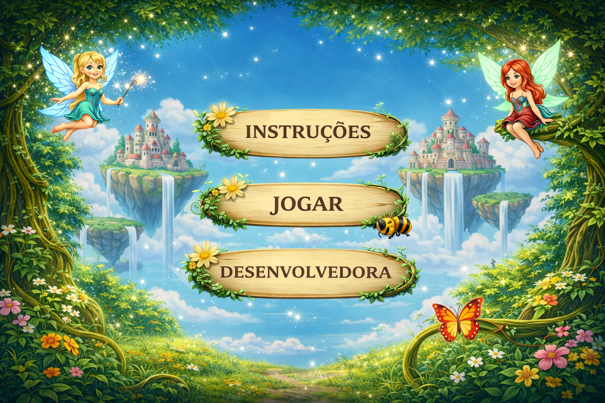

🧚 Fairy Game

1. Identificação do Projeto

Título: Fairy Game
Desenvolvedor: Evelin Piva
Professor Orientador: Professor Carlos Roberto da Silva Filho
Instituição: Sesi Senai
Curso: Técnico em Desenvolvimento de Sistemas

2. Visão Geral do Sistema
Descrição

O jogo Fairy Game é uma experiência 2D multiplayer local desenvolvida em JavaScript utilizando a Canvas API.

O objetivo principal é controlar duas fadas simultaneamente, coletando itens e desviando de obstáculos enquanto competem em pontuação.

Personagens
🟠 Fada Laranja (WASD)
🔵 Fada Azul (Setas)
Elementos do jogo

Durante o jogo, surgem:

Obstáculos (insetos)

Itens coletáveis (corações e poções)

Mudança de cenário conforme a fase

3. Objetivo

Sobreviver, coletar itens e alcançar a maior pontuação.

🏆 Vence o jogador que atingir 130 pontos primeiro.

4. Requisitos Funcionais

ID	Requisito	Descrição

RF01	Movimento	Cada fada possui controle independente

RF02	Sistema de Vidas	Perda de vida ao colidir com insetos

RF03	Pontuação	Sistema de pontos em tempo real

RF04	Coletáveis	Corações recuperam vida e poções somam pontos

RF05	Colisão	Sistema de colisão entre objetos

RF06	Progressão de Fases	Mudança de fase por pontuação

RF07	Multijogador	Dois jogadores simultâneos

RF08	Interface	Menu, Jogo, Vitória e Game Over

RF09	Áudio	Música e efeitos sonoros dinâmicos

5. Requisitos Não Funcionais

ID	Requisito	Descrição

RNF01	Tecnologia	JavaScript ES6, HTML5 e Canvas

RNF02	Performance	Atualização via requestAnimationFrame

RNF03	Portabilidade	Executa diretamente no navegador

RNF04	Usabilidade	Interface simples e responsiva

RNF05	Áudio	Controle de música com persistência

RNF06	Experiência	Feedback visual e sonoro

6. Regras de Negócio

ID	Regra
RN01	Insetos causam perda de vida

RN02	Corações aumentam a vida

RN03	Poções aumentam a pontuação

RN04	Fase 1: até 40 pontos

RN05	Fase 2: até 90 pontos

RN06	Fase 3: até 130 pontos

RN07	Vence quem atingir 130 pontos primeiro

RN08	RN08 Se uma fada perder todas as vidas, o jogo termina para ambos

7. Controles

Jogador	Teclas	Ação

🟠 Fada Laranja	W, A, S, D	Movimentação

🔵 Fada Azul	↑ ↓ ← →	Movimentação

8. Mecânicas do Jogo

🐝 Obstáculos

Insetos- Causam perda de vida
💖 Itens
Corações → +1 vida
Poções → +10 pontos

9. Progressão de Fases

Fase	Pontuação	Cenário	Dificuldade
Fase 1	0+	Inicial	Normal
Fase 2	40+	Tarde	Média
Fase 3	90+	Noite	Difícil

10. Sistema de Áudio

Música de fundo com loop automático
Sons para:

Colisão com insetos
Coleta de coração
Coleta de poção

11. Interface do Jogo

O jogo contém:

🎮 Menu inicial
📜 Instruções
👩‍💻 Tela do desenvolvedor
🏆 Tela de vitória
💀 Tela de Game Over
12. Lógica Técnica

O jogo utiliza:

canvas para renderização
Classes para objetos (Fada, Abelha, etc.)
Loop principal com requestAnimationFrame
Sistema de estados:

menu
jogando
gameover
vitoria_jogador1
vitoria_jogador2

Sistema de colisão em tempo real  
Gerenciamento de múltiplos objetos simultâneos (insetos e itens)

13. Estrutura do Projeto
/img         → imagens do jogo  
/sons        → áudios  
/index.html  → página principal  
/game.js     → lógica do jogo  
/inicio.html → menu  
/desenv.html → página do desenvolvedor  

14. Execução do Projeto
📥 Abrir o projeto

Abra o arquivo:

index.html

Ou utilize a extensão Live Server no VS Code.

15. Créditos

Desenvolvedora: Evelin Piva
Instagram: @p.evelinn
Instituição: Sesi Senai
Professor: Carlos Roberto da Silva Filho